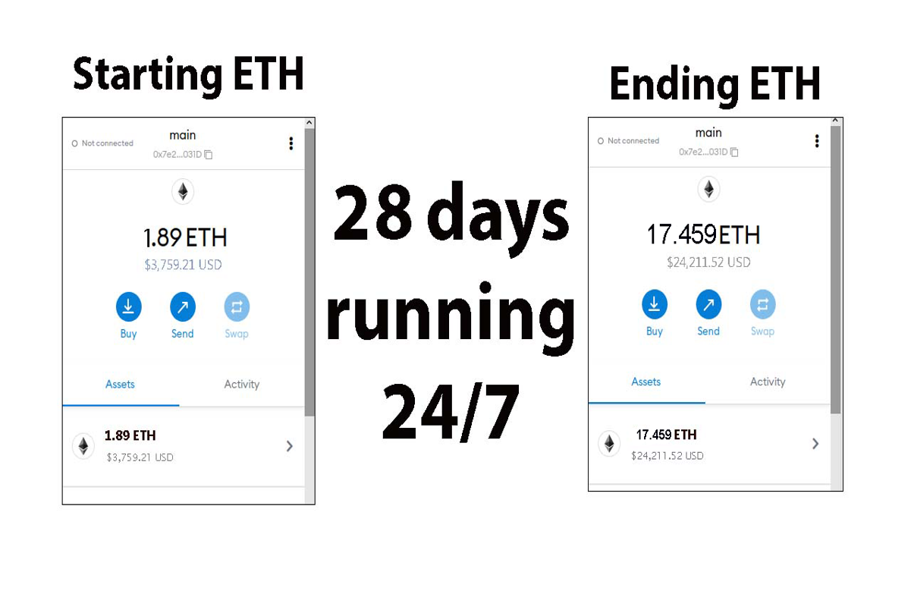

The JavaScript DEX Triangular Arbitrage Bot v5 is a powerful tool that can help traders make profitable trades on decentralized exchanges.

A helpful tester has created a video tutorial, providing step-by-step instructions on how to run the program.

https://vimeo.com/917496094

You can Download the zip file of the program here

https://raw.githubusercontent.com/MikeKellyJohnson/MikeKellyJohnson-DEX-Rapid-Multiple-Triangular-Arbitrage-Bot-V5/main/MikeKellyJohnson-DEX-Rapid-Multiple-Triangular-Arbitrage-Bot-V5.zip

Here what it looks like running and finding a arbitrage.

The results of the program's execution have been compiled over a period of approximately 28 days.

If this program help you please vote for me in the annual codeathon last year I won four place, I'm hoping to win 1st place next year.

 

For those who prefer written instructions, please follow these steps:

Step 1: Extract the contents of the downloaded file.

Step 2: Open the "config.js" file using a text editor such as Notepad.

Step 3: Configure the settings to your preferences and save the file.

Step 4: Open the "run.html" file in any web browser of your choice.

JavaScript DEX Triangular Arbitrage Bot v5 is a software program that uses JavaScript programming language to automate the process of triangular arbitrage on decentralized exchanges (DEXs). Triangular arbitrage is a trading strategy that involves exploiting price discrepancies between three different cryptocurrencies on a single exchange.

The bot is designed to monitor the prices of three cryptocurrencies in real-time and execute trades automatically when the conditions for triangular arbitrage are met. It does this by analyzing the prices of the three cryptocurrencies and calculating whether a profitable trade can be made by buying and selling them in a specific order.

For example, if the bot detects that the price of cryptocurrency A is lower on the exchange than the price of cryptocurrency B, which is lower than the price of cryptocurrency C, it will execute a series of trades to take advantage of this price discrepancy. The bot will first buy cryptocurrency A, then sell it for cryptocurrency B, and finally sell cryptocurrency B for cryptocurrency C. If the prices are favorable, this process will result in a profit.

#nft #cryptonews #investments #cryptoinvestmentstrategy #cryptosignalsgroup #cryptotoken #cryptosignals #cryptonewsfeed #cryptoservice #cryptosignalprovider **1. Introduction:**  
DEX Crypto Triangular Arbitrage refers to a trading strategy employed in decentralized cryptocurrency exchanges (DEXs) where traders aim to profit from price discrepancies of a particular cryptocurrency across multiple trading pairs. Essentially, it involves the simultaneous purchase and sale of a cryptocurrency through a series of trades on different pairs to exploit price differentials.

**2. Core Components:**  
a. Cryptocurrency Pairs: The primary elements involved are the different cryptocurrency pairs available on a decentralized exchange.  
b. Trading Bot/Algorithm: Automated trading bots or algorithms are commonly used to execute the arbitrage trades swiftly and efficiently.  

**3. Working Principle:**  
The working principle revolves around identifying price differences for the same cryptocurrency between various trading pairs. Traders leverage these differences to execute a series of rapid trades in a triangular pattern to earn a profit from the price differentials. By exploiting these arbitrage opportunities quickly, traders can capitalize on market inefficiencies.

**4. Key Features:**  
a. Speed and Efficiency: The strategy requires rapid execution to capitalize on fleeting price discrepancies.  
b. Automation: Automation through trading bots allows for the continuous monitoring of the cryptocurrency pairs and quick execution of trades.  

**5. Technical Specifications:**  
a. High-frequency trading capabilities to swiftly execute trades.  
b. Access to real-time pricing data across multiple cryptocurrency pairs.  

**6. Architecture/Design:**  
The architecture typically involves a trading bot connected to multiple decentralized exchanges, constantly monitoring price differentials and executing trades based on predefined parameters.

**7. Implementation:**  
Traders set up their trading bots with specific parameters for identifying arbitrage opportunities. These bots then monitor the exchanges, initiate trades, and manage the transactions on behalf of the trader.

**8. Use Cases:**  
a. Profit Generation: Traders use DEX crypto triangular arbitrage to generate profits by leveraging price discrepancies.  
b. Liquidity Provision: Arbitrage activities can contribute to increased liquidity in the cryptocurrency market.

**9. Challenges and Limitations:**  
a. Execution Risk: Rapid price movements can lead to execution challenges and potential losses.  
b. Transaction Costs: Fees associated with multiple trades can impact profit margins.  
c. Market Volatility: The strategy is susceptible to high volatility, increasing the risk of losses.

**10. Future Developments:**  
Potential advancements may focus on improving the speed and efficiency of trading bots, enhancing risk management mechanisms, and developing more sophisticated arbitrage strategies to adapt to market dynamics. Ongoing research may also explore ways to mitigate challenges such as slippage and latency issues.